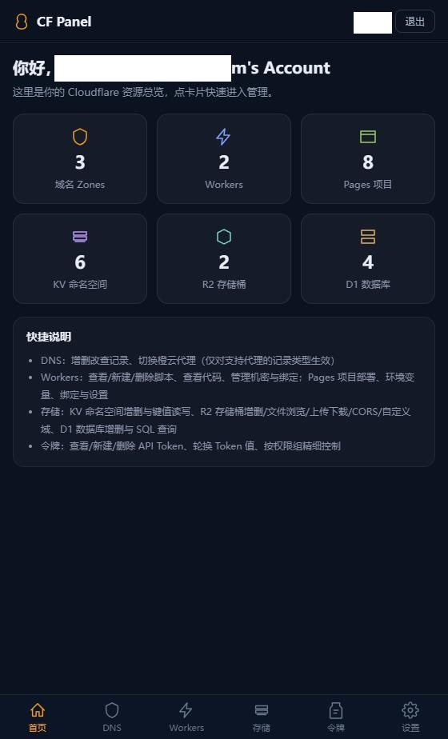
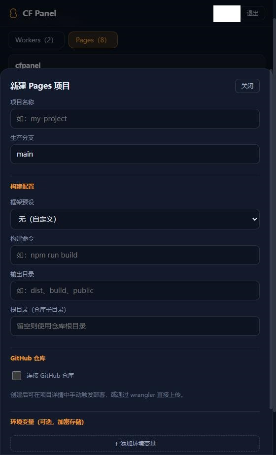
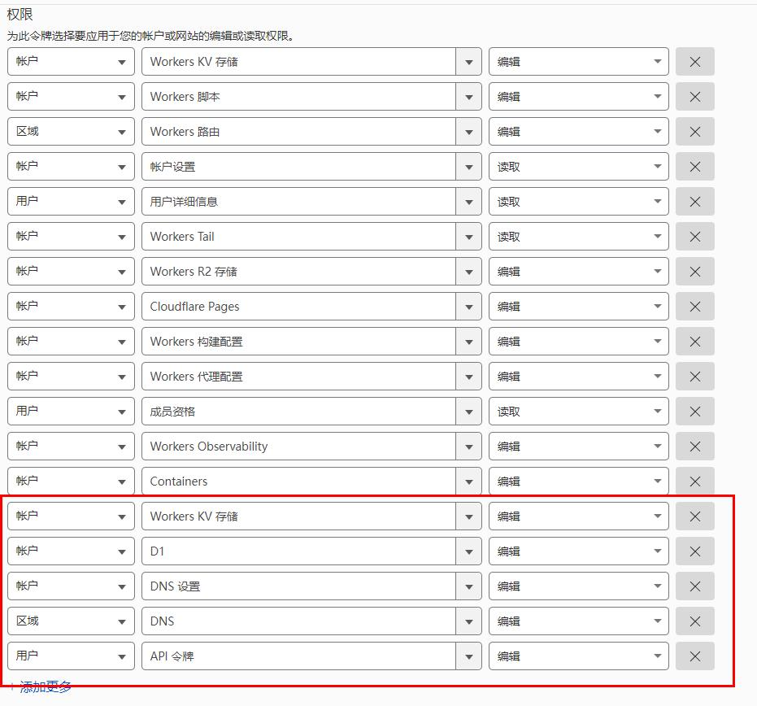

# CF Panel
Cloudflare 管理面板 -浏览器端  部署在cloudflare的pages上

用浏览器 就能管理：

- **DNS**：域名列表、DNS 记录增删改查、一键切换橙云代理
- **Workers**：脚本列表与代码查看、新建/删除、机密变量管理、绑定管理（KV/R2/D1/明文）
- **Pages**：项目列表、部署记录、环境变量管理、绑定管理、新建项目支持 GitHub 仓库连接
- **存储**：KV 命名空间与键值管理、R2 存储桶列表与文件浏览/上传/下载、D1 数据库 SQL 执行与表浏览


## 安全设计

- 面板采用**账户+密码**认证（`PANEL_USERS`），每个 API 请求都会校验，凭据只存在浏览器 localStorage
- **Cloudflare API Token**（`CF_API_TOKEN`）只存在服务端环境变量，经 `/api/proxy/` 转发调用 Cloudflare API，**绝不下发到浏览器**
- 密码校验使用恒定时间比较，防时序侧信道攻击

## 环境变量

在 Cloudflare Pages 项目 **设置 → 环境变量** 中配置（生产环境建议同时配置到 Production 与 Preview）：

| 变量名 | 必填 | 说明 |
| --- | --- | --- |
| `PANEL_USERS` | 是 | 面板用户列表，JSON 数组格式 |
| `CF_API_TOKEN` | 是 | Cloudflare API Token，权限见下表 |

### `PANEL_USERS` 怎么填

就是一个 JSON 数组，最外层 `[ ]`，里面每个用户一个 `{ }`。

**单用户（直接复制下面这行，把密码改成你自己的）：**

```
[{"username":"admin","password":"你的密码"}]
```

**两个用户（用逗号分隔）：**

```
[{"username":"admin","password":"你的密码"},{"username":"friend","password":"朋友的密码"}]
```

> 注意：双引号必须是英文双引号 `"`，不能是中文引号。

## API Token 权限

在 [API Tokens 页面](https://dash.cloudflare.com/profile/api-tokens) 创建 Token，推荐按需勾选（至少勾选你要用到的功能）：

选择模板  `编辑 Cloudflare Workers`  按图增加权限


